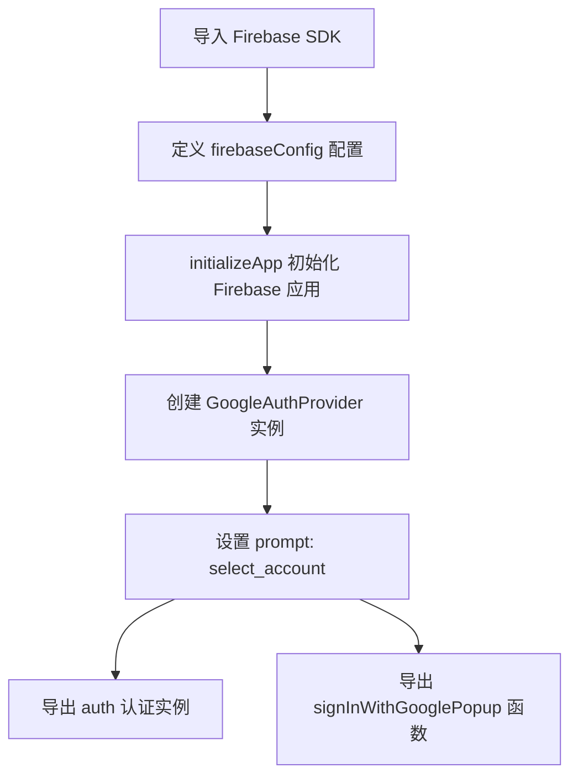
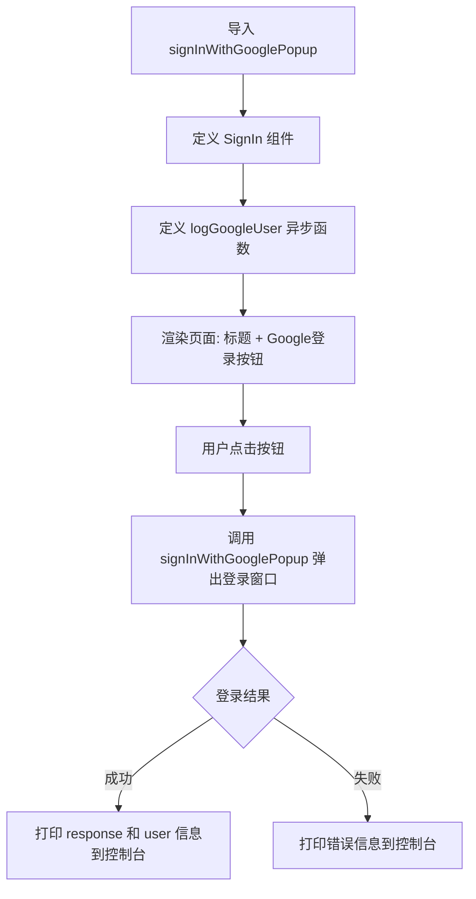

# 项目流程说明

## `firebase.utils.jsx` 流程

这个文件是 **Firebase 初始化与认证工具模块**，流程如下：

1. **导入依赖** —— 从 `firebase/app` 和 `firebase/auth` 引入 `initializeApp`、`getAuth`、`signInWithPopup`、`GoogleAuthProvider`
2. **配置 Firebase** —— 通过 `firebaseConfig` 对象指定 API Key、项目 ID 等连接信息，连接到 Firebase 项目 `crwn-clothing-db-19df5`
3. **初始化应用** —— 调用 `initializeApp(firebaseConfig)` 创建 `firebaseApp` 实例
4. **创建 Google 认证提供者** —— `new GoogleAuthProvider()` 并设置 `prompt: 'select_account'`，确保每次登录都弹出账号选择界面（而非自动使用上次登录的账号）
5. **导出**：
   - `auth` —— 认证实例，供其他地方使用
   - `signInWithGooglePopup` —— 一个函数，调用后会弹出 Google 登录弹窗

---

## `sign-in.component.jsx` 流程

这个文件是 **登录页面组件**，流程如下：

1. **导入** —— 从 `firebase.utils` 引入 `signInWithGooglePopup` 函数
2. **定义组件 `SignIn`** —— 一个函数式 React 组件
3. **定义 `logGoogleUser` 异步函数**（核心逻辑）：
   - 使用 `try/catch` 包裹
   - `await signInWithGooglePopup()` 等待用户完成 Google 弹窗登录
   - 成功后通过 `response?.user` 获取用户信息并打印
   - 失败时捕获错误并打印
4. **渲染 UI**：
   - 显示标题 "Sign In Pages"
   - 渲染一个 **"Sign in with Google"** 按钮，`onClick` 绑定 `logGoogleUser`

---

## 两者协作总结

| 步骤 | 文件                | 动作                                                             |
| ---- | ------------------- | ---------------------------------------------------------------- |
| 1    | `firebase.utils`    | 初始化 Firebase + 配置 Google 认证                               |
| 2    | `sign-in.component` | 渲染登录按钮                                                     |
| 3    | 用户点击按钮        | 触发 `logGoogleUser`                                             |
| 4    | `logGoogleUser`     | 调用 `signInWithGooglePopup()`                                   |
| 5    | `firebase.utils`    | 实际执行 `signInWithPopup(auth, provider)`，弹出 Google 登录窗口 |
| 6    | `sign-in.component` | 接收返回结果，打印用户信息或错误                                 |

目前流程比较简单，只是把登录结果打印到控制台。后续通常会在此基础上扩展：将用户信息存入 **React Context** 或 **状态管理**，实现全局用户状态共享。
